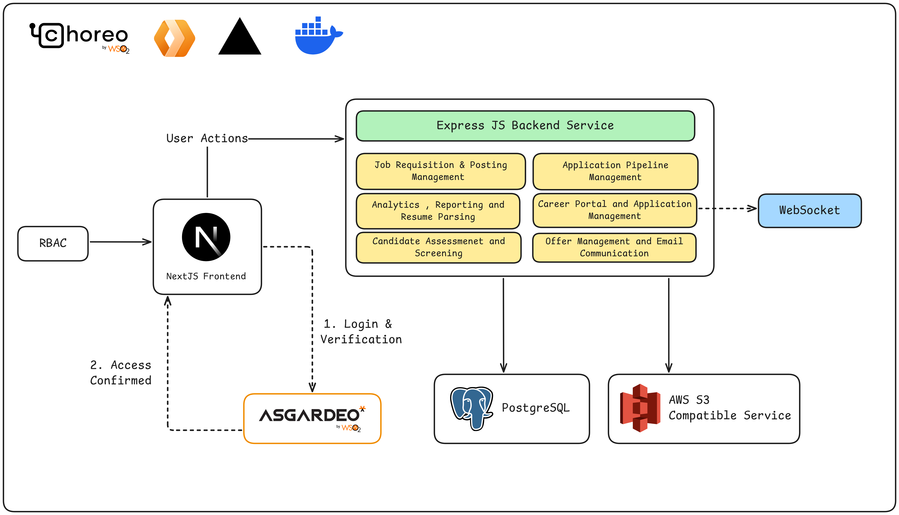

# Technical Architecture

OpenATS is built using a modern, modular architecture powered بالكامل by open-source technologies. Each component has a clear responsibility while working together as a unified system.

## Overview

- Frontend (Next.js) – Handles UI, user actions, and RBAC-based access
- Backend (Express.js) – Core services and business logic
- Database (PostgreSQL) – Structured data storage
- Object Storage (S3 Compatible) – File storage (resumes, assets)
- Auth Layer (Asgardeo / OAuth) – Authentication and verification
- Realtime (WebSocket) – Live updates and communication

### Frontend

Built with Next.js, it manages user interactions, authentication flow, and communicates with backend services via APIs.

### Backend

The Express.js service handles core modules such as pipeline management, candidate processing, analytics, and communication.

### Data & Storage

- PostgreSQL stores structured data like candidates and pipelines
- S3-compatible storage is used for resumes and file assets

### Authentication

Authentication is handled using Asgardeo.

- Supports secure login and user verification
- Uses OAuth / OIDC standards
- Enables role-based access control (RBAC)

### Communication

- REST APIs connect frontend and backend
- WebSockets enable real-time updates

## Deployment Patterns

OpenATS supports flexible deployment options:

- Docker-based Deployment – Recommended for local and production setups
- Frontend Deployment – Vercel, Cloudflare Pages
- Backend Deployment – Render or similar platforms
- Full Platform Deployment – WSO2 Choreo (deploy frontend & backend as services/web apps)
